# Stock Sector Algorithmic Financial Analysis	

• Utilized Pandas libraries to import historical stock information of communication stocks into Matplotlib charting of the financial Greeks

•	Incorporated financial analysis through a daily percentage change algorithm that allowed visualization in scatter matrix plots correlations

•	Collected daily return historical data to engineer a Daily Cumulative return that showcased an investor’s return against a time series index

```python
import numpy as np
import pandas as pd
import matplotlib.pyplot as plt
%matplotlib inline
```


```python
import pandas_datareader
import datetime
```


```python
import pandas_datareader.data as web
```


```python
start = datetime.datetime(2012, 1, 1)
end = datetime.datetime(2017, 1, 1)
tesla = web.DataReader("TSLA", 'google', start, end)
```


```python
tesla.head()
```


<div>
<style>
    .dataframe thead tr:only-child th {
        text-align: right;
    }

    .dataframe thead th {
        text-align: left;
    }

    .dataframe tbody tr th {
        vertical-align: top;
    }
</style>
<table border="1" class="dataframe">
  <thead>
    <tr style="text-align: right;">
      <th></th>
      <th>Open</th>
      <th>High</th>
      <th>Low</th>
      <th>Close</th>
      <th>Volume</th>
    </tr>
    <tr>
      <th>Date</th>
      <th></th>
      <th></th>
      <th></th>
      <th></th>
      <th></th>
    </tr>
  </thead>
  <tbody>
    <tr>
      <th>2012-01-03</th>
      <td>28.94</td>
      <td>29.50</td>
      <td>27.65</td>
      <td>28.08</td>
      <td>928052</td>
    </tr>
    <tr>
      <th>2012-01-04</th>
      <td>28.21</td>
      <td>28.67</td>
      <td>27.50</td>
      <td>27.71</td>
      <td>630036</td>
    </tr>
    <tr>
      <th>2012-01-05</th>
      <td>27.76</td>
      <td>27.93</td>
      <td>26.85</td>
      <td>27.12</td>
      <td>1005432</td>
    </tr>
    <tr>
      <th>2012-01-06</th>
      <td>27.20</td>
      <td>27.79</td>
      <td>26.41</td>
      <td>26.89</td>
      <td>687081</td>
    </tr>
    <tr>
      <th>2012-01-09</th>
      <td>27.00</td>
      <td>27.49</td>
      <td>26.12</td>
      <td>27.25</td>
      <td>896951</td>
    </tr>
  </tbody>
</table>
</div>


```python
tesla.to_csv('Tesla_Stock.csv')
```


```python
ford = web.DataReader("F", 'google', start, end)
gm = web.DataReader("GM",'google',start,end)
```


```python
ford.head()
```


<div>
<style>
    .dataframe thead tr:only-child th {
        text-align: right;
    }

    .dataframe thead th {
        text-align: left;
    }

    .dataframe tbody tr th {
        vertical-align: top;
    }
</style>
<table border="1" class="dataframe">
  <thead>
    <tr style="text-align: right;">
      <th></th>
      <th>Open</th>
      <th>High</th>
      <th>Low</th>
      <th>Close</th>
      <th>Volume</th>
    </tr>
    <tr>
      <th>Date</th>
      <th></th>
      <th></th>
      <th></th>
      <th></th>
      <th></th>
    </tr>
  </thead>
  <tbody>
    <tr>
      <th>2012-01-03</th>
      <td>11.00</td>
      <td>11.25</td>
      <td>10.99</td>
      <td>11.13</td>
      <td>45709811</td>
    </tr>
    <tr>
      <th>2012-01-04</th>
      <td>11.15</td>
      <td>11.53</td>
      <td>11.07</td>
      <td>11.30</td>
      <td>79725188</td>
    </tr>
    <tr>
      <th>2012-01-05</th>
      <td>11.33</td>
      <td>11.63</td>
      <td>11.24</td>
      <td>11.59</td>
      <td>67877467</td>
    </tr>
    <tr>
      <th>2012-01-06</th>
      <td>11.74</td>
      <td>11.80</td>
      <td>11.52</td>
      <td>11.71</td>
      <td>59840605</td>
    </tr>
    <tr>
      <th>2012-01-09</th>
      <td>11.83</td>
      <td>11.95</td>
      <td>11.70</td>
      <td>11.80</td>
      <td>53981467</td>
    </tr>
  </tbody>
</table>
</div>


```python
ford.to_csv('Ford_Stock.csv')
```


```python
gm.head()
```


<div>
<style>
    .dataframe thead tr:only-child th {
        text-align: right;
    }

    .dataframe thead th {
        text-align: left;
    }

    .dataframe tbody tr th {
        vertical-align: top;
    }
</style>
<table border="1" class="dataframe">
  <thead>
    <tr style="text-align: right;">
      <th></th>
      <th>Open</th>
      <th>High</th>
      <th>Low</th>
      <th>Close</th>
      <th>Volume</th>
    </tr>
    <tr>
      <th>Date</th>
      <th></th>
      <th></th>
      <th></th>
      <th></th>
      <th></th>
    </tr>
  </thead>
  <tbody>
    <tr>
      <th>2012-01-03</th>
      <td>20.83</td>
      <td>21.18</td>
      <td>20.75</td>
      <td>21.05</td>
      <td>9321420</td>
    </tr>
    <tr>
      <th>2012-01-04</th>
      <td>21.05</td>
      <td>21.37</td>
      <td>20.75</td>
      <td>21.15</td>
      <td>7856752</td>
    </tr>
    <tr>
      <th>2012-01-05</th>
      <td>21.10</td>
      <td>22.29</td>
      <td>20.96</td>
      <td>22.17</td>
      <td>17884040</td>
    </tr>
    <tr>
      <th>2012-01-06</th>
      <td>22.26</td>
      <td>23.03</td>
      <td>22.24</td>
      <td>22.92</td>
      <td>18234608</td>
    </tr>
    <tr>
      <th>2012-01-09</th>
      <td>23.20</td>
      <td>23.43</td>
      <td>22.70</td>
      <td>22.84</td>
      <td>12091714</td>
    </tr>
  </tbody>
</table>
</div>


```python
gm.to_csv('GM_Stock.csv')
```


```python
tesla['Open'].plot(label='Tesla',figsize=(16,8),title='Open Price')
gm['Open'].plot(label='GM')
ford['Open'].plot(label='Ford')
plt.legend()
```


    <matplotlib.legend.Legend at 0x23e6f795240>


    

    


____


```python
tesla['Volume'].plot(label='Tesla',figsize=(16,8),title='Volume Traded')
gm['Volume'].plot(label='gm')
ford['Volume'].plot(label='ford')
plt.legend()
```


    <matplotlib.legend.Legend at 0x23e6fd68390>


    
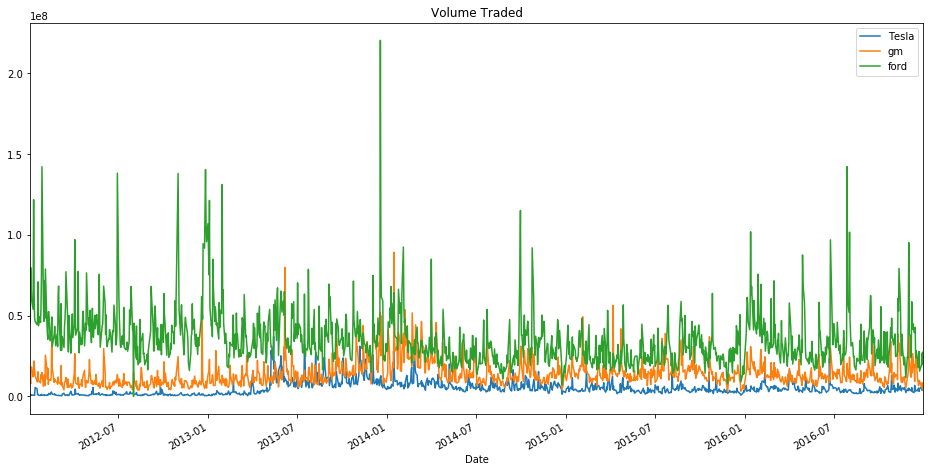
    


```python
ford['Volume'].argmax()
```


    Timestamp('2013-12-18 00:00:00')


____


```python
tesla['Total Traded'] = tesla['Open']*tesla['Volume']
ford['Total Traded'] = ford['Open']*ford['Volume']
gm['Total Traded'] = gm['Open']*gm['Volume']
```


```python
tesla['Total Traded'].plot(label='Tesla',figsize=(16,8))
gm['Total Traded'].plot(label='GM')
ford['Total Traded'].plot(label='Ford')
plt.legend()
plt.ylabel('Total Traded')
```


    <matplotlib.text.Text at 0x23e6fd924a8>


    
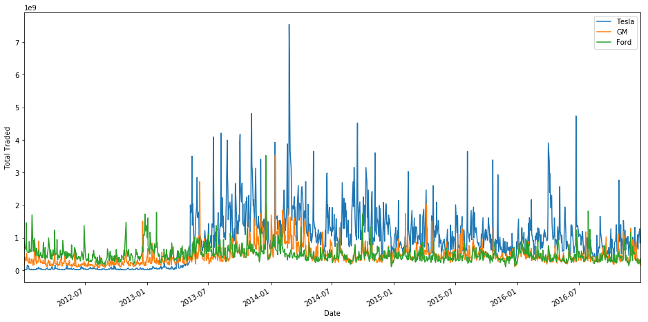
    


```python
tesla['Total Traded'].argmax()
```


    Timestamp('2014-02-25 00:00:00')


____

** Let's practice plotting out some MA (Moving Averages). Plot out the MA50 and MA200 for GM. **


```python
gm['MA50'] = gm['Open'].rolling(50).mean()
gm['MA200'] = gm['Open'].rolling(200).mean()
gm[['Open','MA50','MA200']].plot(label='gm',figsize=(16,8))
```


    <matplotlib.axes._subplots.AxesSubplot at 0x23e6fd846d8>


    
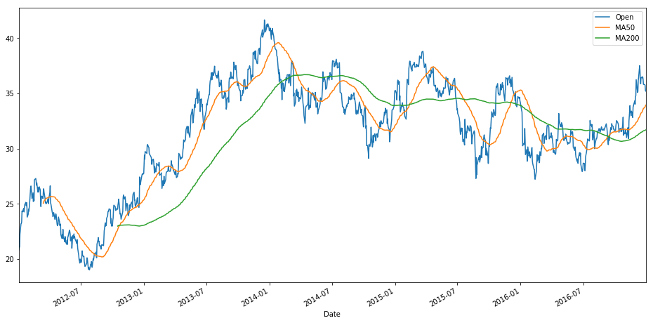
    


______

** Finally lets see if there is a relationship between these stocks, after all, they are all related to the car industry. We can see this easily through a scatter matrix plot. Import scatter_matrix from pandas.plotting and use it to create a scatter matrix plot of all the stocks'opening price. You may need to rearrange the columns into a new single dataframe. Hints and info can be found here: https://pandas.pydata.org/pandas-docs/stable/visualization.html#scatter-matrix-plot **


```python
from pandas.plotting import scatter_matrix
```


```python
car_comp = pd.concat([tesla['Open'],gm['Open'],ford['Open']],axis=1)
```


```python
car_comp.columns = ['Tesla Open','GM Open','Ford Open']
```


```python
# You can use a semi-colon to remove the axes print outs
scatter_matrix(car_comp,figsize=(8,8),alpha=0.2,hist_kwds={'bins':50});
```


    
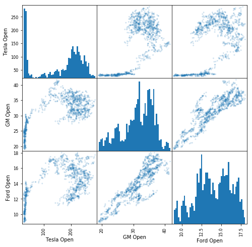
    


```python
from matplotlib.finance import candlestick_ohlc
from matplotlib.dates import DateFormatter, date2num, WeekdayLocator, DayLocator, MONDAY

# Rest the index to get a column of January Dates
ford_reset = ford.loc['2012-01':'2012-01'].reset_index()

# Create a new column of numerical "date" values for matplotlib to use
ford_reset['date_ax'] = ford_reset['Date'].apply(lambda date: date2num(date))
ford_values = [tuple(vals) for vals in ford_reset[['date_ax', 'Open', 'High', 'Low', 'Close']].values]

mondays = WeekdayLocator(MONDAY)        # major ticks on the mondays
alldays = DayLocator()              # minor ticks on the days
weekFormatter = DateFormatter('%b %d')  # e.g., Jan 12
dayFormatter = DateFormatter('%d')      # e.g., 12

#Plot it
fig, ax = plt.subplots()
fig.subplots_adjust(bottom=0.2)
ax.xaxis.set_major_locator(mondays)
ax.xaxis.set_minor_locator(alldays)
ax.xaxis.set_major_formatter(weekFormatter)

candlestick_ohlc(ax, ford_values, width=0.6, colorup='g',colordown='r');
```


    
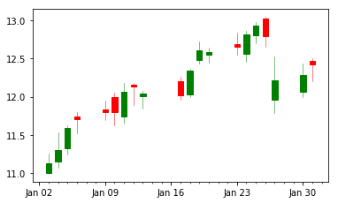
    


## Daily Percentage Change
First we will begin by calculating the daily percentage change. Daily percentage change is defined by the following formula:

$ r_t = \frac{p_t}{p_{t-1}} -1$

This defines r_t (return at time t) as equal to the price at time t divided by the price at time t-1 (the previous day) minus 1. Basically this just informs you of your percent gain (or loss) if you bought the stock on day and then sold it the next day. While this isn't necessarily helpful for attempting to predict future values of the stock, its very helpful in analyzing the volatility of the stock. If daily returns have a wide distribution, the stock is more volatile from one day to the next. Let's calculate the percent returns and then plot them with a histogram, and decide which stock is the most stable!


```python
# Method 1: Using shift
tesla['returns'] = (tesla['Close'] / tesla['Close'].shift(1) ) - 1
```


```python
tesla.head()
```


<div>
<style>
    .dataframe thead tr:only-child th {
        text-align: right;
    }

    .dataframe thead th {
        text-align: left;
    }

    .dataframe tbody tr th {
        vertical-align: top;
    }
</style>
<table border="1" class="dataframe">
  <thead>
    <tr style="text-align: right;">
      <th></th>
      <th>Open</th>
      <th>High</th>
      <th>Low</th>
      <th>Close</th>
      <th>Volume</th>
      <th>Total Traded</th>
      <th>returns</th>
    </tr>
    <tr>
      <th>Date</th>
      <th></th>
      <th></th>
      <th></th>
      <th></th>
      <th></th>
      <th></th>
      <th></th>
    </tr>
  </thead>
  <tbody>
    <tr>
      <th>2012-01-03</th>
      <td>28.94</td>
      <td>29.50</td>
      <td>27.65</td>
      <td>28.08</td>
      <td>928052</td>
      <td>26857824.88</td>
      <td>NaN</td>
    </tr>
    <tr>
      <th>2012-01-04</th>
      <td>28.21</td>
      <td>28.67</td>
      <td>27.50</td>
      <td>27.71</td>
      <td>630036</td>
      <td>17773315.56</td>
      <td>-0.013177</td>
    </tr>
    <tr>
      <th>2012-01-05</th>
      <td>27.76</td>
      <td>27.93</td>
      <td>26.85</td>
      <td>27.12</td>
      <td>1005432</td>
      <td>27910792.32</td>
      <td>-0.021292</td>
    </tr>
    <tr>
      <th>2012-01-06</th>
      <td>27.20</td>
      <td>27.79</td>
      <td>26.41</td>
      <td>26.89</td>
      <td>687081</td>
      <td>18688603.20</td>
      <td>-0.008481</td>
    </tr>
    <tr>
      <th>2012-01-09</th>
      <td>27.00</td>
      <td>27.49</td>
      <td>26.12</td>
      <td>27.25</td>
      <td>896951</td>
      <td>24217677.00</td>
      <td>0.013388</td>
    </tr>
  </tbody>
</table>
</div>


```python
tesla['returns'] = tesla['Close'].pct_change(1)
```


```python
tesla.head()
```


<div>
<style>
    .dataframe thead tr:only-child th {
        text-align: right;
    }

    .dataframe thead th {
        text-align: left;
    }

    .dataframe tbody tr th {
        vertical-align: top;
    }
</style>
<table border="1" class="dataframe">
  <thead>
    <tr style="text-align: right;">
      <th></th>
      <th>Open</th>
      <th>High</th>
      <th>Low</th>
      <th>Close</th>
      <th>Volume</th>
      <th>Total Traded</th>
      <th>returns</th>
    </tr>
    <tr>
      <th>Date</th>
      <th></th>
      <th></th>
      <th></th>
      <th></th>
      <th></th>
      <th></th>
      <th></th>
    </tr>
  </thead>
  <tbody>
    <tr>
      <th>2012-01-03</th>
      <td>28.94</td>
      <td>29.50</td>
      <td>27.65</td>
      <td>28.08</td>
      <td>928052</td>
      <td>26857824.88</td>
      <td>NaN</td>
    </tr>
    <tr>
      <th>2012-01-04</th>
      <td>28.21</td>
      <td>28.67</td>
      <td>27.50</td>
      <td>27.71</td>
      <td>630036</td>
      <td>17773315.56</td>
      <td>-0.013177</td>
    </tr>
    <tr>
      <th>2012-01-05</th>
      <td>27.76</td>
      <td>27.93</td>
      <td>26.85</td>
      <td>27.12</td>
      <td>1005432</td>
      <td>27910792.32</td>
      <td>-0.021292</td>
    </tr>
    <tr>
      <th>2012-01-06</th>
      <td>27.20</td>
      <td>27.79</td>
      <td>26.41</td>
      <td>26.89</td>
      <td>687081</td>
      <td>18688603.20</td>
      <td>-0.008481</td>
    </tr>
    <tr>
      <th>2012-01-09</th>
      <td>27.00</td>
      <td>27.49</td>
      <td>26.12</td>
      <td>27.25</td>
      <td>896951</td>
      <td>24217677.00</td>
      <td>0.013388</td>
    </tr>
  </tbody>
</table>
</div>


```python
# Now repeat for the other dataframes
ford['returns'] = ford['Close'].pct_change(1)
gm['returns'] = gm['Close'].pct_change(1)
```


```python
ford.head()
```


<div>
<style>
    .dataframe thead tr:only-child th {
        text-align: right;
    }

    .dataframe thead th {
        text-align: left;
    }

    .dataframe tbody tr th {
        vertical-align: top;
    }
</style>
<table border="1" class="dataframe">
  <thead>
    <tr style="text-align: right;">
      <th></th>
      <th>Open</th>
      <th>High</th>
      <th>Low</th>
      <th>Close</th>
      <th>Volume</th>
      <th>Total Traded</th>
      <th>returns</th>
    </tr>
    <tr>
      <th>Date</th>
      <th></th>
      <th></th>
      <th></th>
      <th></th>
      <th></th>
      <th></th>
      <th></th>
    </tr>
  </thead>
  <tbody>
    <tr>
      <th>2012-01-03</th>
      <td>11.00</td>
      <td>11.25</td>
      <td>10.99</td>
      <td>11.13</td>
      <td>45709811</td>
      <td>5.028079e+08</td>
      <td>NaN</td>
    </tr>
    <tr>
      <th>2012-01-04</th>
      <td>11.15</td>
      <td>11.53</td>
      <td>11.07</td>
      <td>11.30</td>
      <td>79725188</td>
      <td>8.889358e+08</td>
      <td>0.015274</td>
    </tr>
    <tr>
      <th>2012-01-05</th>
      <td>11.33</td>
      <td>11.63</td>
      <td>11.24</td>
      <td>11.59</td>
      <td>67877467</td>
      <td>7.690517e+08</td>
      <td>0.025664</td>
    </tr>
    <tr>
      <th>2012-01-06</th>
      <td>11.74</td>
      <td>11.80</td>
      <td>11.52</td>
      <td>11.71</td>
      <td>59840605</td>
      <td>7.025287e+08</td>
      <td>0.010354</td>
    </tr>
    <tr>
      <th>2012-01-09</th>
      <td>11.83</td>
      <td>11.95</td>
      <td>11.70</td>
      <td>11.80</td>
      <td>53981467</td>
      <td>6.386008e+08</td>
      <td>0.007686</td>
    </tr>
  </tbody>
</table>
</div>


```python
gm.head()
```


<div>
<style>
    .dataframe thead tr:only-child th {
        text-align: right;
    }

    .dataframe thead th {
        text-align: left;
    }

    .dataframe tbody tr th {
        vertical-align: top;
    }
</style>
<table border="1" class="dataframe">
  <thead>
    <tr style="text-align: right;">
      <th></th>
      <th>Open</th>
      <th>High</th>
      <th>Low</th>
      <th>Close</th>
      <th>Volume</th>
      <th>Total Traded</th>
      <th>MA50</th>
      <th>MA200</th>
      <th>returns</th>
    </tr>
    <tr>
      <th>Date</th>
      <th></th>
      <th></th>
      <th></th>
      <th></th>
      <th></th>
      <th></th>
      <th></th>
      <th></th>
      <th></th>
    </tr>
  </thead>
  <tbody>
    <tr>
      <th>2012-01-03</th>
      <td>20.83</td>
      <td>21.18</td>
      <td>20.75</td>
      <td>21.05</td>
      <td>9321420</td>
      <td>1.941652e+08</td>
      <td>NaN</td>
      <td>NaN</td>
      <td>NaN</td>
    </tr>
    <tr>
      <th>2012-01-04</th>
      <td>21.05</td>
      <td>21.37</td>
      <td>20.75</td>
      <td>21.15</td>
      <td>7856752</td>
      <td>1.653846e+08</td>
      <td>NaN</td>
      <td>NaN</td>
      <td>0.004751</td>
    </tr>
    <tr>
      <th>2012-01-05</th>
      <td>21.10</td>
      <td>22.29</td>
      <td>20.96</td>
      <td>22.17</td>
      <td>17884040</td>
      <td>3.773532e+08</td>
      <td>NaN</td>
      <td>NaN</td>
      <td>0.048227</td>
    </tr>
    <tr>
      <th>2012-01-06</th>
      <td>22.26</td>
      <td>23.03</td>
      <td>22.24</td>
      <td>22.92</td>
      <td>18234608</td>
      <td>4.059024e+08</td>
      <td>NaN</td>
      <td>NaN</td>
      <td>0.033829</td>
    </tr>
    <tr>
      <th>2012-01-09</th>
      <td>23.20</td>
      <td>23.43</td>
      <td>22.70</td>
      <td>22.84</td>
      <td>12091714</td>
      <td>2.805278e+08</td>
      <td>NaN</td>
      <td>NaN</td>
      <td>-0.003490</td>
    </tr>
  </tbody>
</table>
</div>


```python
ford['returns'].hist(bins=50)
```


    <matplotlib.axes._subplots.AxesSubplot at 0x23e71a40f28>


    
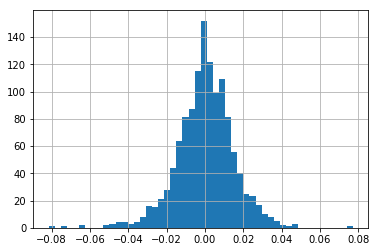
    


```python
gm['returns'].hist(bins=50)
```


    <matplotlib.axes._subplots.AxesSubplot at 0x23e71ebffd0>


    
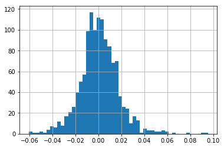
    


```python
tesla['returns'].hist(bins=50)
```


    <matplotlib.axes._subplots.AxesSubplot at 0x23e7224b6d8>


    

    


```python
tesla['returns'].hist(bins=100,label='Tesla',figsize=(10,8),alpha=0.5)
gm['returns'].hist(bins=100,label='GM',alpha=0.5)
ford['returns'].hist(bins=100,label='Ford',alpha=0.5)
plt.legend()
```


    <matplotlib.legend.Legend at 0x23e71c5d048>


    

    


```python
tesla['returns'].plot(kind='kde',label='Tesla',figsize=(12,6))
gm['returns'].plot(kind='kde',label='GM')
ford['returns'].plot(kind='kde',label='Ford')
plt.legend()
```


    <matplotlib.legend.Legend at 0x23e71b940b8>


    
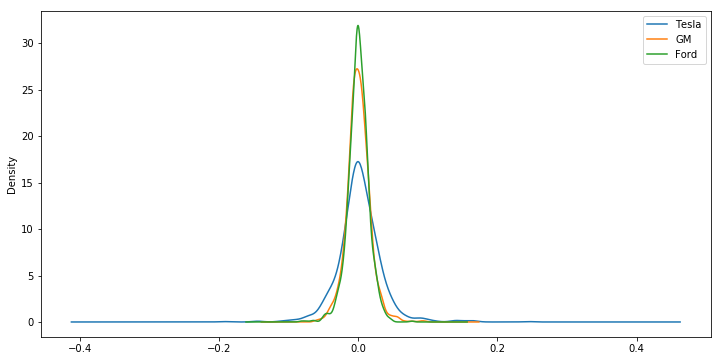
    


```python
box_df = pd.concat([tesla['returns'],gm['returns'],ford['returns']],axis=1)
box_df.columns = ['Tesla Returns',' GM Returns','Ford Returns']
box_df.plot(kind='box',figsize=(8,11),colormap='jet')
```


    <matplotlib.axes._subplots.AxesSubplot at 0x23e72da60f0>


    
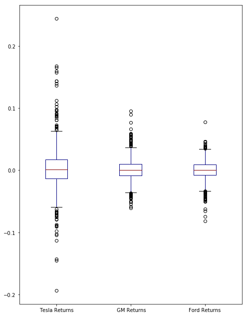
    


```python
scatter_matrix(box_df,figsize=(8,8),alpha=0.2,hist_kwds={'bins':50});
```


    
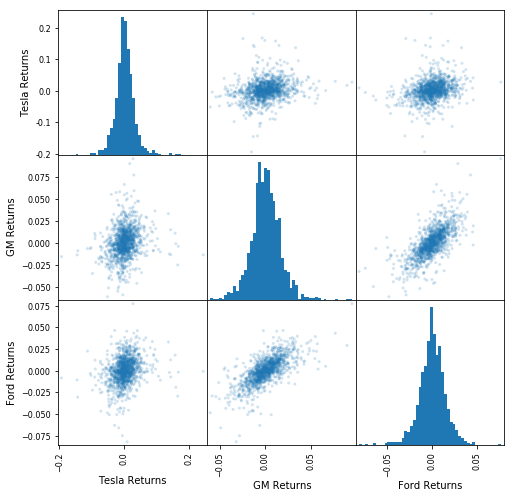
    


```python
box_df.plot(kind='scatter',x=' GM Returns',y='Ford Returns',alpha=0.4,figsize=(10,8))
```


    <matplotlib.axes._subplots.AxesSubplot at 0x23e733f6f98>


    
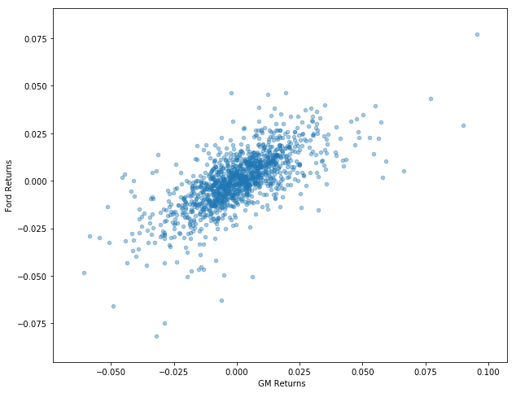
    


Lets us say there is a stock 'ABC' that is being actively traded on an exchange. ABC has the following prices corresponding to the dates given

    Date                        Price
    01/01/2018                   10
    01/02/2018                   15
    01/03/2018                   20
    01/04/2018                   25

**Daily Return** : Daily return is the profit/loss made by the stock compared to the previous day. (This is what ew just calculated above). A value above one indicates profit, similarly a value below one indicates loss. It is also expressed in percentage to convey the information better. (When expressed as percentage, if the value is above 0, the stock had give you profit else loss). So for the above example the daily returns would be

    Date                         Daily Return                  %Daily Return
    01/01/2018                 10/10 =  1                          -   
    01/02/2018                 15/10 =  3/2                       50%
    01/03/2018                 20/15 =  4/3                       33%
    01/04/2018                 25/20 =  5/4                       20%

    Date                       Cumulative Return         %Cumulative Return
    01/01/2018                  10/10 =  1                         100 %   
    01/02/2018                  15/10 =  3/2                       150 %
    01/03/2018                  20/10 =  2                         200 %
    01/04/2018                  25/10 =  5/2                       250 %

The formula for a cumulative daily return is:

$ i_i = (1+r_t) * i_{t-1} $

Here we can see we are just multiplying our previous investment at i at t-1 by 1+our percent returns. Pandas makes this very simple to calculate with its cumprod() method. Using something in the following manner:

    df[daily_cumulative_return] = ( 1 + df[pct_daily_return] ).cumprod()
    


```python
tesla['Cumulative Return'] = (1 + tesla['returns']).cumprod()
```


```python
tesla.head()
```


<div>
<style>
    .dataframe thead tr:only-child th {
        text-align: right;
    }

    .dataframe thead th {
        text-align: left;
    }

    .dataframe tbody tr th {
        vertical-align: top;
    }
</style>
<table border="1" class="dataframe">
  <thead>
    <tr style="text-align: right;">
      <th></th>
      <th>Open</th>
      <th>High</th>
      <th>Low</th>
      <th>Close</th>
      <th>Volume</th>
      <th>Total Traded</th>
      <th>returns</th>
      <th>Cumulative Return</th>
    </tr>
    <tr>
      <th>Date</th>
      <th></th>
      <th></th>
      <th></th>
      <th></th>
      <th></th>
      <th></th>
      <th></th>
      <th></th>
    </tr>
  </thead>
  <tbody>
    <tr>
      <th>2012-01-03</th>
      <td>28.94</td>
      <td>29.50</td>
      <td>27.65</td>
      <td>28.08</td>
      <td>928052</td>
      <td>26857824.88</td>
      <td>NaN</td>
      <td>NaN</td>
    </tr>
    <tr>
      <th>2012-01-04</th>
      <td>28.21</td>
      <td>28.67</td>
      <td>27.50</td>
      <td>27.71</td>
      <td>630036</td>
      <td>17773315.56</td>
      <td>-0.013177</td>
      <td>0.986823</td>
    </tr>
    <tr>
      <th>2012-01-05</th>
      <td>27.76</td>
      <td>27.93</td>
      <td>26.85</td>
      <td>27.12</td>
      <td>1005432</td>
      <td>27910792.32</td>
      <td>-0.021292</td>
      <td>0.965812</td>
    </tr>
    <tr>
      <th>2012-01-06</th>
      <td>27.20</td>
      <td>27.79</td>
      <td>26.41</td>
      <td>26.89</td>
      <td>687081</td>
      <td>18688603.20</td>
      <td>-0.008481</td>
      <td>0.957621</td>
    </tr>
    <tr>
      <th>2012-01-09</th>
      <td>27.00</td>
      <td>27.49</td>
      <td>26.12</td>
      <td>27.25</td>
      <td>896951</td>
      <td>24217677.00</td>
      <td>0.013388</td>
      <td>0.970442</td>
    </tr>
  </tbody>
</table>
</div>


```python
ford['Cumulative Return'] = (1 + ford['returns']).cumprod()
gm['Cumulative Return'] = (1 + gm['returns']).cumprod()
```


```python
tesla['Cumulative Return'].plot(label='Tesla',figsize=(16,8),title='Cumulative Return')
ford['Cumulative Return'].plot(label='Ford')
gm['Cumulative Return'].plot(label='GM')
plt.legend()
```


    <matplotlib.legend.Legend at 0x23e73542b70>


    

    

